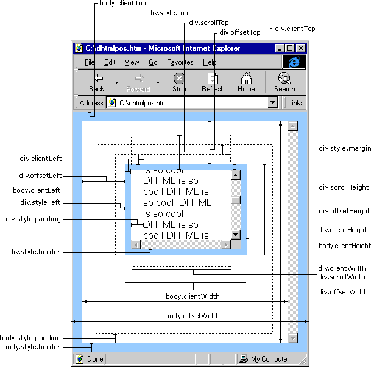

## vue cli安装使用
```
# 安装 vue-cli3 
npm install -g @vue/cli
# 桥接 vue-cli2 的init
npm install -g @vue/cli-init
# 创建项目 vue-cli3 
vue create xxx
# 创建项目 vue-cli2
vue init webpack xxx

# 初始化项目 
npm install 
# 运行项目
npm run dev
# 构建项目
npm run build

# 安装依赖
npm install xxx --save
```

## 不错的文章
[这些vue技巧，你值得拥有](https://juejin.im/post/5ef8050f5188252e8272bd01)

[绝对干货~！学会这些Vue小技巧，可以早点下班和女神约会了](https://juejin.im/post/5eddbaee5188254344768fdc#heading-14)

[实战技巧，Vue原来还可以这样写](https://juejin.im/post/5eef7799f265da02cd3b82fe)

[Flex布局详解](https://www.cnblogs.com/qcloud1001/p/9848619.html)

[vue组件name的作用小结](https://www.jb51.net/article/140702.htm)

[去哪网地址](http://piao.qunar.com/touch/)

[iView Admin 后台管理模板GItHub](https://github.com/iview/iview-admin)

[iView Admin 后台管理模板](https://gitee.com/icarusion/iview-admin)

#### 1. 第三方库
 0.  [一个凑合的 Vue.js 移动端 UI 组件库](https://vux.li/)
 1.  [css动画 animate.css](https://daneden.github.io/animate.css/)
 2.  [一像素边框 border.css]()
 3.  [重置默认样式 reset.css](https://cssreset.com/)
 3.  [重置默认样式 Normalize.css](http://necolas.github.io/normalize.css/)
 4.  [velocityjs动画库](http://velocityjs.org/)
 5.  [velocityjs动画库GitHub](https://github.com/julianshapiro/velocity)
 6.  [swiper图片轮播](https://www.swiper.com.cn/)
 7.  [fastclick](https://github.com/ftlabs/fastclick) `npm install fastclick -S`
 8.  [better-scroll](https://github.com/ustbhuangyi/better-scroll)                  
 9.  [vue下拉刷新](https://www.npmjs.com/package/vue-scroller) 
     [文档](https://www.jianshu.com/p/31ad32e7ec13)
     [强烈推荐优秀的Vue UI组件库](https://www.jianshu.com/p/398a3b2e535f)
 10. [VUE 插件最全集](https://blog.csdn.net/hjh15827475896/article/details/78207066)
     


#### 2. 完美解决 vscode 在 style 中没有代码提示的问题
`设置中把 Snippets Prevent Quick Suggestions 勾掉即可`


#### 3. sass,less,stylus
    ``` 
    ### 引用外部样式文件路径问题
    CSS loader 会把把非根路径的url解释为相对路径， 加~前缀才会解释成模块路径。
    <style  lang="stylus">
        //使用 ../来匹配路径可以正确导入
        @import '../assets/css/main.styl'; //正确
        // 加~前缀
        @import '~@/assets/scss/helpers/_mixin'; //正确
        //使用 alias 中 配的 @ 就不能用了
        @import '@/assets/css/main.styl';  //错误
    </style>
    
    ```

#### 4. [IE9兼容问题](https://www.cnblogs.com/chenguiya/p/9255202.html)

#### 获取浏览器窗口的可视区域高度和宽度,滚动条高度有需要的朋友可参考一下。
```javascript
document.body.clientWidth // ==> BODY对象宽度
document.body.clientHeight // ==> BODY对象高度
document.documentElement.clientWidth // ==> 可见区域宽度
document.documentElement.clientHeight // ==> 可见区域高度
  
document.body.clientWidth // ==> 网页可见区域宽 
document.body.clientHeight // ==> 网页可见区域高
document.body.offsetWidth // ==> 网页可见区域宽(包括边线的宽)
document.body.offsetHeight // ==> 网页可见区域高(包括边线的高)
document.body.scrollWidth // ==> 网页正文全文宽document.body.scrollHeight // ==> 网页正文全文高
document.body.scrollTop // ==> 网页被卷去的高
document.body.scrollLeft // ==> 网页被卷去的左
window.screenTop // ==> 网页正文部分上
window.screenLeft // ==> 网页正文部分左
window.screen.height // ==> 屏幕分辨率的高
window.screen.width // ==> 屏幕可用工作区高度
window.screen.availHeight // ==> 屏幕可用工作区高度
window.screen.availWidth // ==> 屏幕可用工作区宽度
```

####  部分jquery函数获取方法
```javascript
// 部分jQuery函数  
$(window).height() 　              //浏览器时下窗口可视区域高度   
$(document).height()　           //浏览器时下窗口文档的高度   
$(document.body).height()　　　　　　//浏览器时下窗口文档body的高度   
$(document.body).outerHeight(true)　//浏览器时下窗口文档body的总高度 包括border padding margin   
$(window).width() 　   //浏览器时下窗口可视区域宽度   
$(document).width()   //浏览器时下窗口文档对于象宽度   
$(document.body).width()　　　　　　//浏览器时下窗口文档body的高度   
$(document.body).outerWidth(true)　//浏览器时下窗口文档body的总宽度 包括border padding
```

```javascript
alert($(document).scrollTop()); //获取滚动条到顶部的垂直高度
alert($(document).scrollLeft()); //获取滚动条到左边的垂直宽度
// HTML精确定位:  scrollLeft,scrollWidth,clientWidth,offsetWidth   
// scrollHeight: 获取对象的滚动高度。   
// scrollLeft: 设置或获取位于对象左边界和窗口中目前可见内容的最左端之间的距离   
// scrollTop:  设置或获取位于对象最顶端和窗口中可见内容的最顶端之间的距离   
// scrollWidth: 获取对象的滚动宽度   
// offsetHeight:获取对象相对于版面或由父坐标 offsetParent 属性指定的父坐标的高度   
// offsetLeft: 获取对象相对于版面或由 offsetParent 属性指定的父坐标的计算左侧位置   
// offsetTop:  获取对象相对于版面或由 offsetTop 属性指定的父坐标的计算顶端位置   
event.clientX // 相对文档的水平座标   
event.clientY // 相对文档的垂直座标   
event.offsetX // 相对容器的水平坐标   
event.offsetY // 相对容器的垂直坐标   
document.documentElement.scrollTop // 垂直方向滚动的值   
event.clientX+document.documentElement.scrollTop // 相对文档的水平座标+垂直方向滚动的量
```

```javascript
获取屏幕宽高

      window.screen.width / window.screen.height //总区域
      window.screen.availWidth / window.screen.availHeight//可用区域
      //有些手机存在底部任务栏，一般直接用第一个就ok
获取浏览器宽高

      width = window.outerWidth
      height = window.outerHeight
获取浏览器位置

      left = window.screenX || window.screenLeft
      top = window.screenY || window.screenTop
获取页面宽高

      (方法1)
      width = window.innerWidth 
             || document.documentElement.clientWidth 
             || document.body.clientWidth
      height = window.innerHeight 
              || document.documentElement.clientHeight 
              || document.body.clientHeight
      (方法2)
      function getPageSize(){
         var page = document.documentElement
                   ?document.documentElement
                   :document.body,
             gcr = page.getbBoundingClientRect()
         return {
            width:Math.abs(gcr.right-gcr.left),
            height:Math.abs(gcr.bottom-gcr.top)
         }
      }
      // (移动端，一般用inner就ok了)
      width = window.innerWidth
      height =  window.innerHeight
获取element宽高

      1、内部宽高client(padding+content，不包滚动条和border)
          width = elment.clientWidth
          height = elment.clientHeight
      2、整体宽高offset(padding+content+border+滚动条)
          width = elment.offsetWidth
          height = elment.offsetHeight
      3、含被overflow隐藏的内部宽高scroll（无滚动条时同1、client）
          width = elment.scrollWidth
          height = elment.scrollHeight
      4、内容宽高getBoundingClientRect(只包含content)
          size = element.getBoundingClientRect().width / height
          ie8-不支持width / height可运用right-left/bottom-top解决
获取element位置

      offsetParent:设有position值为absolute或relative的最近的上级元素

      1、相对父元素(offsetParent)左上角定位
          left = element.offsetLeft
          top =  element.offsetTop

      2、相对视口左上角定位 
          position=element.getBoundingClientRect().left/right/top/bottom
          //在ie下调试时，加上onscroll动态监听scrollTop数据才会正常刷新
获取滚动条位置

      1、获取element对象滚动条位置
         scrollTop = element.scrollTop

      2、获取window滚动条位置兼容性方法
         scrollTop = window.scrollY 
                      || window.pageYOffset 
                      || (document.documentElement.scrollTop===0
                          ?document.body.scrollTop
                          :document.documentElement.scrollTop
                          );    
         //在ie下调试时，加上onscroll动态监听scrollTop数据才会正常刷新  
```


